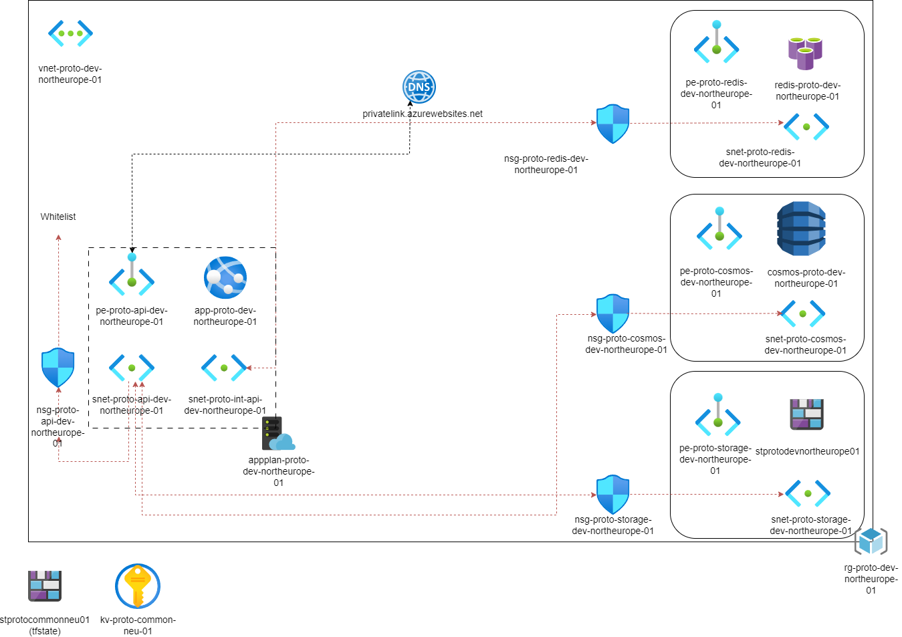

# Azure DevOps infrastructure provisioning
### Technologies used:
**Azure** (cloud provider)
**Terraform** (Infrastructure as code)
**GitHub Actions** (CICD)

### Infrastructructure diagram


### Project purpose:
- To showcase the ability to create **modular terraform infrastructure for Azure**
- To showcase the ability to **deploy** said architecture **using GitHub Actions YAML pipelines**
- To showcase the ability to setup the needed azure resources, permissions for the **CICD pipeline** and the development environment for a new azure project, with step by step documentation of the process further down in the readme file
- To showcase reasonable familiarity with **Azure networking**
- To showcase understanding of **linux commands** through their usage in the CICD pipeline
- To showcase basic understanding of **container technologies (docker)**, used in Azure app service

### Possible additions and points of improvement

1. Add frontend app service and lock down backend API app service to only allow traffic from the frontend app
2. Use managed identity instead of connection strings for connecting to the database and other resources where possible
3. Pull secrets from the Azure key vault with a private endpoint
4. Add additional steps to pipeline for adding and removing nsg security rules
5. Add a terraform variable for app service IPs for cloudflare and similar integrations
6. Put subnet address ranges into variables
7. Add custom domain settings and related to app service
8. Setup backups, failovers and related for the database

### Setup
Project setup section will attempt to capture every step needed as of September 2024 to get a new project that uses Azure, Terraform and GitHub actions going from scratch


That includes amongst other things:
- Setting up the repository
- Setting up the working environment to work with Azure and terraform
- Making the needed Azure resouces in the Azure portal
- Making resources with Terraform
- Creating Terraform modules for those resources
- Using Terraform variables
- Azure networking
- Setting up the Github actions deployment pipeline
---
- Install **Azure CLI** (Ubuntu commands below)
    https://learn.microsoft.com/en-us/cli/azure/install-azure-cli   (for all systems)
    https://learn.microsoft.com/en-us/cli/azure/install-azure-cli-linux?pivots=apt (for linux)

    ```curl -sL https://aka.ms/InstallAzureCLIDeb | sudo bash```

- Login to Azure CLI and connect to appropriate tenant/subscription
   https://learn.microsoft.com/en-us/cli/azure/authenticate-azure-cli-interactively

- Install Terraform (Ubuntu commands below)
    https://developer.hashicorp.com/terraform/install

    ```wget -O- https://apt.releases.hashicorp.com/gpg | sudo gpg --dearmor -o /usr/share/keyrings/hashicorp-archive-keyring.gpg
    echo "deb [signed-by=/usr/share/keyrings/hashicorp-archive-keyring.gpg] https://apt.releases.hashicorp.com $(lsb_release -cs) main" | sudo tee /etc/apt/sources.list.d/hashicorp.list
    sudo apt update && sudo apt install terraform```

- Make a github repository for your code
   ***IN YOUR ORGANIZATION*** (Make an org with a repo for your code if org is not there)
- Clone the repository from the VSCode bash terminal
   (perform github SSH key setup if necessary)
   https://phoenixnap.com/kb/git-clone-ssh (VSCode linux SSH setup)
   https://gist.github.com/Lancear/4b884d55d62bbfb3e42b16058bb48edd (VSCode windows SSH setup)
   ```git clone ___repo_code_button_link___```

- Make terraform directory in repo
   ```mkdir terraform```

- Create first Azure resource in terraform (resource group) and deploy it to test if everything's working as it should
   https://learn.microsoft.com/en-us/azure/developer/terraform/create-resource-group?tabs=azure-cli

- Switch to deploying infrastructure through github actions
   https://github.com/Azure-Samples/terraform-github-actions


    - Manually make an azure storage account (where the remote terraform state for deployment pipelines will be stored)
       https://learn.microsoft.com/en-us/azure/developer/terraform/store-state-in-azure-storage?tabs=azure-cli
       #!/bin/bash

       RESOURCE_GROUP_NAME=rg-projectname-common-region-01
       STORAGE_ACCOUNT_NAME=stprojectcommonregion01    (max 24 chars)
       CONTAINER_NAME=terraform-projectname-common-region-01

       # Create resource group
       ```az group create --name $RESOURCE_GROUP_NAME --location westeurope```

       # Create storage account
       ```az storage account create --resource-group $RESOURCE_GROUP_NAME --name $STORAGE_ACCOUNT_NAME --sku Standard_LRS --encryption-services blob```

       # Create blob container
      ``` az storage container create --name $CONTAINER_NAME --account-name $STORAGE_ACCOUNT_NAME```

    - Manually create Azure key vault in common resource group from last step
       - Name it kv-projectname-common-region-01
       - Create Admin/DevOps Entra(Azure AD) group that will be able to see keys and secrets in the vault
       - Add users that will be able to be see the secrets (Admins/Devops Engineers, senior devs etc.)
       - Go to key vault > Access control > Role Assignments > Add > Add role assignment > Select key Vault administrator role (and Data Access Admin) > Members = DevOps group > Review + assign
       - Go to resource group, assign key vault administrator and data access admin to DevOps group as well
       - Wait for group RBAC to propagate (or just add key vault admin for user to key vault and do your work right away, remove it after)
    - Add backend part to providers.tf
       - https://learn.microsoft.com/en-us/azure/developer/terraform/store-state-in-azure-storage?tabs=azure-cli
    - Create Github Environment (prod) (you must be a repo admin)
       - https://github.com/Azure-Samples/terraform-github-actions
    - Setup Azure identity
       - Create 2 Azure applications in Azure Entra (AD)
          Read-write and read-only
          named  terraform-github-actions-readwrite and terraform-github-actions-readonly
       - Add user to App owners (anyone who should be able to edit this app connection)
       - https://learn.microsoft.com/en-us/azure/developer/github/connect-from-azure-openid-connect   (Go through all of these)
         - Add appropriate permissions for both apps (contributor to subscription and Reader and Data Access for terraform state storage account)
         - Configure a federate identity cred to trust tokens issued by GitHub actions
         https://learn.microsoft.com/en-us/entra/workload-id/workload-identity-federation-create-trust?pivots=identity-wif-apps-methods-azp
         Name for credentials
         github-actions-terraform-token-euw-readwrite
         github-actions-terraform-token-euw-readonly1
         github-actions-terraform-token-euw-readonly2
         - Add github secrets to repository for read-only identity
         https://docs.github.com/en/actions/security-for-github-actions/security-guides/using-secrets-in-github-actions#creating-encrypted-secrets-for-a-repository
         - Add secret on production environment using read-write identity (AZURE_CLIENT_ID)
         note: environment secrets overwrite repository secrets
--------
Helpful links for the setup process:
- https://learn.microsoft.com/en-us/azure/cloud-adoption-framework/ready/azure-best-practices/resource-naming (How to name Azure terraform resources)
- https://www.crayon.com/pl/resources/insights/manage-your-secrets-with-terraform-and-azure-key-vault/ (Azure key vault secret management)
- https://docs.github.com/en/actions/managing-workflow-runs-and-deployments/managing-deployments/managing-environments-for-deployment#creating-an-environment (Creating a Github Actions environment)
- https://docs.github.com/en/actions/managing-workflow-runs-and-deployments/managing-deployments/managing-environments-for-deployment#environment-protection-rules (Github Actions environement rules)
- https://learn.microsoft.com/en-us/azure/app-service/deploy-github-actions?tabs=openid%2Caspnetcore (Deploying to Azure app service with Github Actions)
- https://www.youtube.com/watch?v=yfBtjLxn_6k (Github Actions brief overview/jumpstart)
- https://developer.hashicorp.com/terraform/language/settings/backends/azurerm (Terraform remote backend)
- https://learn.microsoft.com/en-us/entra/workload-id/workload-identity-federation-create-trust?pivots=identity-wif-apps-methods-azp (Azure permission/app setup for Github Actions)
- https://medium.com/@phaubus/azure-private-endpoint-storage-account-use-case-712823001a2f (Azure private endpoint storage example)
- https://learn.microsoft.com/en-us/azure/cloud-adoption-framework/ready/azure-best-practices/private-link-and-dns-integration-at-scale (Azure private endpoint and dns zone integration)
- https://github.com/epomatti/azure-terraform-private-endpoints (Azure private endpoints in Terraform)
--------------------------------------------------------------------------------